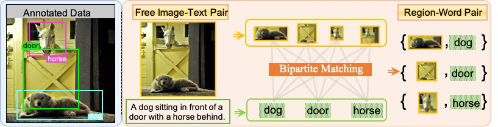

# VLDet: Learning Object-Language Alignments for Open-Vocabulary Object Detection

<p align="center">  </p>

> [**Learning Object-Language Alignments for Open-Vocabulary Object Detection**](https://arxiv.org/abs/2211.14843),               
> Chuang Lin, Peize Sun, Yi Jiang, Ping Luo, Lizhen Qu, Gholamreza Haffari, Zehuan Yuan, Jianfei Cai,    
> *ICLR 2023 ([https://arxiv.org/abs/2211.14843](https://arxiv.org/abs/2211.14843))*   

## Highlight

We are excited to announce that our paper was accepted to ICLR 2023! 🥳🥳🥳


## A quick explainable video demo for VLDet


https://user-images.githubusercontent.com/6366788/218620999-1eb5c5eb-0479-4dcc-88ca-863f34de25a0.mp4


## Performance

### Open-Vocabulary on COCO

<p align="center">

<p>


### Open-Vocabulary on LVIS

<p align="center">

<p>

## Installation

### Requirements
- Linux or macOS with Python ≥ 3.7
- PyTorch ≥ 1.9.
  Install them together at [pytorch.org](https://pytorch.org) to make sure of this. Note, please check
  PyTorch version matches that is required by Detectron2.
- Detectron2: follow [Detectron2 installation instructions](https://detectron2.readthedocs.io/tutorials/install.html).

### Example conda environment setup
```bash
conda create --name VLDet python=3.7 -y
conda activate VLDet
conda install pytorch torchvision torchaudio cudatoolkit=11.1 -c pytorch-lts -c nvidia

# under your working directory

git clone https://github.com/clin1223/VLDet.git
cd VLDet
cd detectron2
pip install -e .
cd ..
pip install -r requirements.txt
```

## Features
- Directly learn an open-vocabulary object detector from image-text pairs by formulating the task as a bipartite matching problem.

- State-of-the-art results on Open-vocabulary LVIS and Open-vocabulary COCO.

- Scaling and extending novel object vocabulary easily.


## Benchmark evaluation and training

Please first [prepare datasets](prepare_datasets.md).

The VLDet models are finetuned on the corresponding [Box-Supervised models](https://drive.google.com/drive/folders/1ngb1mBOUvFpkcUM7D3bgIkMdUj2W5FUa?usp=sharing) (indicated by MODEL.WEIGHTS in the config files). Please train or download the Box-Supervised model and place them under VLDet_ROOT/models/ before training the VLDet models.

To train a model, run

```
python train_net.py --num-gpus 8 --config-file /path/to/config/name.yaml
``` 

To evaluate a model with a trained/ pretrained model, run 

```
python train_net.py --num-gpus 8 --config-file /path/to/config/name.yaml --eval-only MODEL.WEIGHTS /path/to/weight.pth
``` 

Download the trained network weights [here](https://drive.google.com/drive/folders/1ngb1mBOUvFpkcUM7D3bgIkMdUj2W5FUa?usp=sharing).

| OV_COCO  | box mAP50 | box mAP50_novel |
|----------|-----------|-----------------|
| [config_RN50](configs/VLDet_OVCOCO_CLIP_R50_1x_caption.yaml) | 45.8      | 32.0            |

| OV_LVIS       | mask mAP_all | mask mAP_novel |
| ------------- | ------------ | -------------- |
| [config_RN50](configs/VLDet_LbaseCCcap_CLIP_R5021k_640b64_2x_ft4x_caption.yaml)   | 30.1         | 21.7           |
| [config_Swin-B](configs/VLDet_LbaseI_CLIP_SwinB_896b32_2x_ft4x_caption.yaml) | 38.1         | 26.3           |
 

## Citation

If you find this project useful for your research, please use the following BibTeX entry.

```
@article{VLDet,
  title={Learning Object-Language Alignments for Open-Vocabulary Object Detection},
  author={Lin, Chuang and Sun, Peize and Jiang, Yi and Luo, Ping and Qu, Lizhen and Haffari, Gholamreza and Yuan, Zehuan and Cai, Jianfei},
  journal={arXiv preprint arXiv:2211.14843},
  year={2022}
}
```

## Acknowledgement
This repository was built on top of [Detectron2](https://github.com/facebookresearch/detectron2), [Detic](https://github.com/facebookresearch/Detic.git), [RegionCLIP](https://github.com/microsoft/RegionCLIP.git) and [OVR-CNN](https://github.com/alirezazareian/ovr-cnn). We thank for their hard work.
